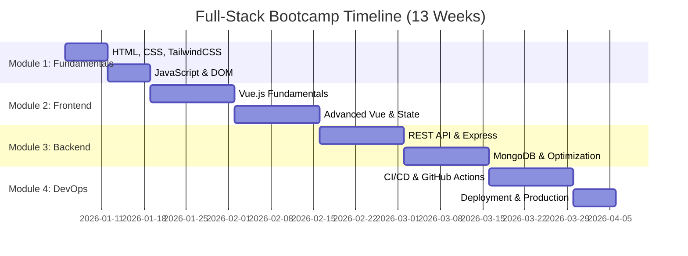
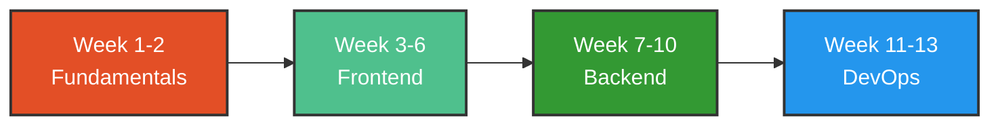

# Welcome to FullStack Development Batch 5

  

**[View Enrolled Students](students/students.md)** | Batch 5 Cohort

---

## Welcome, Future Developers!

Congratulations on taking the first step toward becoming a full-stack developer! Over the next 13 weeks, you'll transform from someone who consumes technology to someone who creates it.

### A Word on Learning

**Here's the truth**: Practical knowledge doesn't come from sitting and listening alone. 

You won't become a developer by:
- ❌ Just watching tutorials
- ❌ Only reading documentation  
- ❌ Passively listening to lectures

You WILL become a developer by:
- ✅ **Writing code every single day**
- ✅ **Building projects, even small ones**
- ✅ **Making mistakes and debugging them**
- ✅ **Asking questions when stuck**
- ✅ **Practicing beyond class hours**
- ✅ **Reviewing and refactoring your code**

Think of it like learning to ride a bike—you can watch hundreds of videos, but you won't truly learn until you get on the bike and start pedaling (and yes, you might fall a few times, and that's okay!).

### Our Commitment to You

We've structured this bootcamp with a 50/50 split between theory and hands-on practice during class. But here's the secret: the real learning happens when you code on your own. The homework, the projects, the bugs you'll encounter at 11 PM—that's where the magic happens.

**Remember**: Every expert developer you admire was once exactly where you are now. The difference? They kept coding when it got hard.

Ready? Let's build something amazing!

---

## Program Overview
- **Duration**: 3 months (13 weeks)
- **Schedule**: Monday - Friday, 1.5 hours/day (theory + practice)
- **Total Hours**: ~97.5 hours
- **Approach**: Cognitive learning with progressive complexity

### Learning Journey

---

## 🛠️ Stacks

  <table>
    <tr>
      <td align="center" style="padding: 10px;">
        
      </td>
      <td align="center" style="padding: 10px;">
        
      </td>
      <td align="center" style="padding: 10px;">
        
      </td>
      <td align="center" style="padding: 10px;">
        
      </td>
    </tr>
    <tr>
      <td align="center" style="padding: 10px;">
        
      </td>
      <td align="center" style="padding: 10px;">
        
      </td>
      <td align="center" style="padding: 10px;">
        
      </td>
      <td align="center" style="padding: 10px;">
        
      </td>
    </tr>
    <tr>
      <td align="center" style="padding: 10px;">
        
      </td>
      <td align="center" style="padding: 10px;">
        
      </td>
      <td align="center" style="padding: 10px;">
        
      </td>
      <td align="center" style="padding: 10px;">
        
      </td>
    </tr>
    <tr>
      <td align="center" style="padding: 10px;">
        
      </td>
      <td align="center" style="padding: 10px;">
        
      </td>
      <td align="center" style="padding: 10px;">
        
      </td>
      <td align="center" style="padding: 10px;">
        
      </td>
    </tr>
  </table>

---

## Module Timeline

### Module 1: Web Fundamentals (2 weeks - 15 hours)
**HTML, CSS & DOM - Building blocks for web development**
*Prerequisite: Programming fundamentals and JavaScript basics*

📚 **[Module 1 Overview](modules/1-fundamental/README.md)**

#### Week 1: HTML, CSS & TailwindCSS (7.5 hours)

**Day 1 (Monday) - HTML Fundamentals** | 1.5 hours | [📖 Lesson](modules/1-fundamental/docs/w1d1-html-fundamentals.md) | [📝 Homework](modules/1-fundamental/homeworks/w1d1-homework.md) | [🧩 Code](modules/1-fundamental/codes/w1d1-code.html) | [▶️ Video](https://youtu.be/9reUhIwxCA0)
- Theory (45 min): HTML syntax, tags, elements, document structure
- Practice (45 min): Create a basic webpage with headings, paragraphs, lists (ordered/unordered)

**Day 2 (Tuesday) - HTML Forms & Semantic HTML** | 1.5 hours | [📖 Lesson](modules/1-fundamental/docs/w1d2-html-forms-semantic.md) | [📝 Homework](modules/1-fundamental/homeworks/w1d2-homework.md) | [🧩 Code](modules/1-fundamental/codes/w1d2) | [▶️ Video](https://drive.google.com/file/d/1TGXoWjI9Pan3oXa4Y0XyA6TyjEQW2DqV/view?usp=drivesdk)
- Theory (40 min): Form elements, input types, attributes, links, images
- Practice (50 min): Build a contact form with validation attributes and semantic structure

**Day 3 (Wednesday) - CSS Fundamentals** | 1.5 hours | [📖 Lesson](modules/1-fundamental/docs/w1d3-css-fundamentals.md) | [📝 Homework](modules/1-fundamental/homeworks/w1d3-homework.md) | [🧩 Code](modules/1-fundamental/codes/w1d3) | [▶️ Video](https://drive.google.com/file/d/1LGTvXKccYxuGbXyu21aTClVSs9UDn2-V/view?usp=sharing)
- Theory (45 min): CSS syntax, selectors, box model, colors, typography
- Practice (45 min): Style the HTML pages created in Day 1-2

**Day 4 (Thursday) - Flexbox & Grid Layouts** | 1.5 hours | [📖 Lesson](modules/1-fundamental/docs/w1d4-flexbox-grid.md) | [📝 Homework](modules/1-fundamental/homeworks/w1d4-homework.md) | [🧩 Code](modules/1-fundamental/codes/w1d4) | [▶️ Video](https://drive.google.com/file/d/1CcPKYbdR86sNSXEDA6EXFY9FWD56tufe/view?usp=drivesdk)
- Theory (30 min): Flexbox properties, Grid layout system
- Practice (60 min): Create responsive layouts using Flexbox and Grid

**Day 5 (Friday) - TailwindCSS & Responsive Design** | 1.5 hours | [📖 Lesson](modules/1-fundamental/docs/w1d5-tailwindcss-responsive.md) | [📝 Homework](modules/1-fundamental/homeworks/w1d5-homework.md) | [🧩 Code](modules/1-fundamental/codes/w1d5) | [▶️ Video](https://drive.google.com/file/d/107L4zBI9vNcN5Imm25U-mJScsTahTqfH/view?usp=drivesdk)
- Theory (40 min): TailwindCSS utility classes, responsive modifiers, configuration
- Practice (50 min): Rebuild previous projects using TailwindCSS, implement responsive breakpoints

---

#### Week 2: JavaScript DOM Manipulation (7.5 hours)

**Day 1 (Monday) - DOM Selection & Traversal** | 1.5 hours | [📖 Lesson](modules/1-fundamental/docs/w2d1-dom-selection.md) | [📝 Homework](modules/1-fundamental/homeworks/w2d1-homework.md) | [🧩 Code](modules/1-fundamental/codes/w2d1) | [▶️ Video](https://drive.google.com/file/d/1xKsOfd9VlDdcumo2G9nFyPSNY-TK_evd/view?usp=drivesdk)
- Theory (45 min): DOM tree structure, querySelector, getElementById, traversing nodes
- Practice (45 min): Select and log different elements, navigate parent/child/sibling nodes

**Day 2 (Tuesday) - DOM Manipulation** | 1.5 hours | [📖 Lesson](modules/1-fundamental/docs/w2d2-dom-manipulation.md) | [📝 Homework](modules/1-fundamental/homeworks/w2d2-homework.md) | [🧩 Code](modules/1-fundamental/codes/w2d2) | [▶️ Video](https://drive.google.com/file/d/1qIplmWA6y8cbCn_CVJQB6DLb7LuBTN8m/view?usp=drivesdk)
- Theory (40 min): Creating, modifying, removing elements; innerHTML vs textContent
- Practice (50 min): Dynamically add/remove/update elements on a webpage 

**Day 3 (Wednesday) - Event Handling** | 1.5 hours | [📖 Lesson](modules/1-fundamental/docs/w2d3-event-handling.md) | [📝 Homework](modules/1-fundamental/homeworks/w2d3-homework.md) | [🧩 Code](modules/1-fundamental/codes/w2d3) | [▶️ Video](https://drive.google.com/file/d/1A91VXnmD0GsOrFFx3uB0-e-b1GkY5gEi/view?usp=sharing)
- Theory (45 min): Event listeners, event types, event object, event delegation, propagation
- Practice (45 min): Build interactive features (buttons, menus, modals) with event handlers

**Day 4 (Thursday) - Form Validation & Local Storage** | 1.5 hours | [📖 Lesson](modules/1-fundamental/docs/w2d4-forms-storage.md) | [📝 Homework](modules/1-fundamental/homeworks/w2d4-homework.md) | [🧩 Code](modules/1-fundamental/codes/w2d4) | [▶️ Video](https://drive.google.com/file/d/1PbqWM4_dmeRP3JNVnQzMOSPp4_KhaFA1/view?usp=sharing)
- Theory (30 min): Form events, validation patterns, localStorage API
- Practice (60 min): Create a form with real-time validation and data persistence

**Day 5 (Friday) - Integration Project** | 1.5 hours | [📖 Lesson](modules/1-fundamental/docs/w2d5-integration-project.md) | [🧩 Code](modules/1-fundamental/codes/w2d5) | [▶️ Video](https://drive.google.com/file/d/1se3hhtagGORUmIy-637u5NbZlVq4NBMC/view?usp=sharing)
- Review (20 min): Q&A on Week 1-2 concepts
- Practice (70 min): Build a complete interactive web app (e.g., Todo List, Calculator) with TailwindCSS styling

**🎯 [End of Module Project: Personal Finance Tracker](modules/1-fundamental/projects/end-of-module-project.md)**

---

**Learning Strategy**: Fast-paced for students with programming background. Focus on web-specific concepts and hands-on building.

---

### Module 2: Frontend Development (4 weeks - 30 hours)
**VueJS + TailwindCSS - Building reactive applications**

📚 **[Module 2 Overview](modules/2-frontend/README.md)**

#### Week 3: Vue.js Fundamentals (7.5 hours)

**Day 1 (Monday) - Introduction to Vue.js & Setup** | 1.5 hours | [📖 Lesson](modules/2-frontend/docs/w3d1-vue-intro-setup.md) | [🧩 Code](modules/2-frontend/codes/w3d1/) | [📝 Homework](modules/2-frontend/homeworks/w3d1-homework.md) | [▶️ Video](https://drive.google.com/file/d/1ONJG-k_w6rZvQpZSa_kUHakUDAWZagv9/view?usp=sharing)
- Theory (45 min): What is Vue.js, reactive frameworks comparison, Vue vs React/Angular, CDN vs CLI setup
- Practice (45 min): Create first Vue app, basic data binding, understand Vue instance

**Day 2 (Tuesday) - Template Syntax & Directives** | 1.5 hours | [📖 Lesson](modules/2-frontend/docs/w3d2-template-directives.md) | [🧩 Code](modules/2-frontend/codes/w3d2/) | [📝 Homework](modules/2-frontend/homeworks/w3d2-homework.md) | [▶️ Video](https://drive.google.com/file/d/1Olq1W8RwdPPTrOImPYt0j5o9u1ktjd93/view?usp=sharing)
- Theory (40 min): Interpolation, v-bind, v-on, v-if/v-show, v-for, event handling
- Practice (50 min): Build interactive list with conditional rendering and event handlers

**Day 3 (Wednesday) - Data Binding & Forms** | 1.5 hours | [📖 Lesson](modules/2-frontend/docs/w3d3-data-binding-forms.md) | [🧩 Code](modules/2-frontend/codes/w3d3/) | [📝 Homework](modules/2-frontend/homeworks/w3d3-homework.md) | [▶️ Video](https://drive.google.com/file/d/1-tqaYz08ouWYlXSGdkq1Yr_oJb6tyCoR/view?usp=sharing)
- Theory (45 min): v-model, two-way binding, form input types, modifiers (.lazy, .number, .trim)
- Practice (45 min): Create form with validation, handle user input, dynamic styling

**Day 4 (Thursday) - Methods & Computed Properties** | 1.5 hours | [📖 Lesson](modules/2-frontend/docs/w3d4-methods-computed.md) | [🧩 Code](modules/2-frontend/codes/w3d4/) | [📝 Homework](modules/2-frontend/homeworks/w3d4-homework.md) | [▶️ Video](https://drive.google.com/file/d/1jCnldluzBPfF2X17S1nJ9dhZ8uuE0VUv/view?usp=sharing)
- Theory (40 min): Methods vs computed vs watchers, reactivity system, data flow
- Practice (50 min): Build calculator with computed properties, shopping cart with watchers

**Day 5 (Friday) - Components Basics** | 1.5 hours | [📖 Lesson](modules/2-frontend/docs/w3d5-components-basics.md) | [🧩 Code](modules/2-frontend/codes/w3d5/) | [📝 Homework](modules/2-frontend/homeworks/w3d5-homework.md)  | [▶️ Video](https://drive.google.com/file/d/11qDETEmNL5iGNMELLat8Wn2yFjJgBqAQ/view?usp=sharing)
- Theory (40 min): Component concept, props, events, component registration
- Practice (50 min): Create reusable card component, build todo app with components

---

#### Week 4: Components & Communication (7.5 hours)

**Day 1 (Monday) - Props & Component Communication** | 1.5 hours | [📖 Lesson](modules/2-frontend/docs/w4d1-props-communication.md) | [📝 Homework](modules/2-frontend/homeworks/w4d1-homework.md) |[🧩 Code](modules/2-frontend/codes/w4d1/) | [▶️ Video](https://drive.google.com/file/d/15VzaN216HAOvxvW3wOii56ncY6yYYXNN/view?usp=sharing)
- Theory (40 min): Props passing, prop validation, prop types, parent-to-child communication
- Practice (50 min): Build nested component structure with data flow

**Day 2 (Tuesday) - Custom Events & Emits** | 1.5 hours | [📖 Lesson](modules/2-frontend/docs/w4d2-custom-events.md) | [📝 Homework](modules/2-frontend/homeworks/w4d2-homework.md) | [🧩 Code](modules/2-frontend/codes/w4d2/) | [▶️ Video](https://drive.google.com/file/d/1deackjW2WtSduR-2takLVd7woueCrH4k/view?usp=sharing)
- Theory (45 min): Emitting custom events, child-to-parent communication, event modifiers
- Practice (45 min): Create interactive components that communicate (e.g., product list with cart)

**Day 3 (Wednesday) - Slots & Component Composition** | 1.5 hours | [📖 Lesson](modules/2-frontend/docs/w4d3-slots-composition.md) | [📝 Homework](modules/2-frontend/homeworks/w4d3-homework.md) | [🧩 Code](modules/2-frontend/codes/w4d3/) | [▶️ Video](https://drive.google.com/file/d/1qSYK1BO3JJjMWJuT61sPLbhkSwVnmUPP/view?usp=sharing)
- Theory (40 min): Default slots, named slots, scoped slots, slot props
- Practice (50 min): Build reusable layout components (Card, Modal, Tabs)

**Day 4 (Thursday) - Component Lifecycle Hooks** | 1.5 hours | [📖 Lesson](modules/2-frontend/docs/w4d4-lifecycle-hooks.md) | [📝 Homework](modules/2-frontend/homeworks/w4d4-homework.md) | [🧩 Code](modules/2-frontend/codes/w4d4/) | [▶️ Video](https://drive.google.com/file/d/10smAla0kXXsSwlinMInC2WT4ccgqbWVa/view?usp=sharing)
- Theory (45 min): Component lifecycle, mounted/created/updated/unmounted, watchers, use cases
- Practice (45 min): Fetch data on mount, cleanup on unmount, track component state

**Day 5 (Friday) - Integration Workshop** | 1.5 hours | [📖 Lesson](modules/2-frontend/docs/w4d5-integration-workshop.md) | [📝 Homework](modules/2-frontend/homeworks/w4d5-homework.md)
- Workshop (75 min): Hands-on integration of all Week 3-4 concepts (props, events, slots, lifecycle hooks)
- Build a complete Movie Review Application combining all learned component patterns

---

#### Week 5: Vue Router & State Management (7.5 hours)

> **⚠️ IMPORTANT**: Before starting Week 5, you **must** install Node.js on your computer. Week 5 transitions from CDN-based development to using build tools (Vite) and proper project structure. Follow the [Node.js Setup Guide](guides/node-setup.md) to install Node.js before Monday's class.

**Day 1 (Monday) - Vue CLI & Router Setup** | 1.5 hours | [📖 Lesson](modules/2-frontend/docs/w5d1-vue-cli-router-setup.md) | [📝 Homework](modules/2-frontend/homeworks/w5d1-homework.md) | [🧩 Code](https://github.com/KimangKhenng/vue-w5) | [▶️ Video](https://drive.google.com/file/d/1DHbu6AA6iDw2VKR1c274KuybvJv1xlER/view?usp=sharing)
- Theory (45 min): SPA concept, npm create vue, project structure, Vue Router basics, Single File Components
- Practice (45 min): Set up Vue project with Router, create Home/About/Contact pages

**Day 2 (Tuesday) - Dynamic Routes & Parameters** | 1.5 hours | [📖 Lesson](modules/2-frontend/docs/w5d2-dynamic-routes.md) | [📝 Homework](modules/2-frontend/homeworks/w5d2-homework.md) | [🧩 Code](https://github.com/KimangKhenng/vue-w5) | [▶️ Video](https://drive.google.com/file/d/1U7TwHx_WmS0rqa8UG91tw7m4DEYyQ8vz/view?usp=sharing)
- Theory (40 min): Route params, query parameters, programmatic navigation, route guards
- Practice (50 min): Build product detail pages, user profiles with dynamic routes

**Day 3 (Wednesday) - Nested Routes & Navigation Guards** | 1.5 hours | [📖 Lesson](modules/2-frontend/docs/w5d3-nested-routes-guards.md) | [📝 Homework](modules/2-frontend/homeworks/w5d3-homework.md) | [🧩 Code](https://github.com/KimangKhenng/vue-w5) | [▶️ Video](https://drive.google.com/file/d/1Y30ssoDAnKHtWhEcXU6fI6YKymevpTkt/view?usp=sharing)
- Theory (45 min): Nested routing, route meta fields, beforeEach, beforeEnter guards
- Practice (45 min): Create nested layout with sidebar navigation, protected routes

**Day 4 (Thursday) - Introduction to Pinia** | 1.5 hours | [📖 Lesson](modules/2-frontend/docs/w5d4-pinia-intro.md) | [📝 Homework](modules/2-frontend/homeworks/w5d4-homework.md) | [🧩 Code](https://github.com/KimangKhenng/vue-w5) | [▶️ Video](https://drive.google.com/file/d/1UiX1O5CIu6l16yhkEMPgn8kYOw1FjLVl/view?usp=sharing)
- Theory (40 min): State management concept, Pinia vs Vuex, stores, state, getters, actions
- Practice (50 min): Create global store for user data, shopping cart, or app settings

**Day 5 (Friday) - Pinia in Practice** | 1.5 hours | [📖 Lesson](modules/2-frontend/docs/w5d5-pinia-advanced.md) | [📝 Homework](modules/2-frontend/homeworks/w5d5-homework.md) | [🧩 Code](https://github.com/KimangKhenng/vue-w5) | [▶️ Video](https://drive.google.com/file/d/1aeAn-oI_m5BoI3EkKd_WLiJnKxIWDn5a/view?usp=sharing)
- Theory (30 min): Multiple stores, store composition, persisting state
- Practice (60 min): Integrate Pinia into existing app, manage complex state

---

#### Week 6: Advanced Features & Deployment (7.5 hours)

**Day 1 (Monday) - API Integration & Async Operations** | 1.5 hours | [📖 Lesson](modules/2-frontend/docs/w6d1-api-integration.md) | [📝 Homework](modules/2-frontend/homeworks/w6d1-homework.md) | [🧩 Code](https://github.com/KimangKhenng/vue-w5) | [▶️ Video](https://drive.google.com/file/d/13luk4smF518EFys0c4Y1lyxXQF4RYcFO/view?usp=sharing)
- Theory (40 min): Fetch API, axios, async/await, loading states, error handling
- Practice (50 min): Build app that fetches data from public API (weather, movies, etc.)

**Day 2 (Tuesday) - Composables & Reusable Logic** | 1.5 hours | [📖 Lesson](modules/2-frontend/docs/w6d2-composables-reusable-logic.md) | [📝 Homework](modules/2-frontend/homeworks/w6d2-homework.md) | [🧩 Code](https://github.com/KimangKhenng/vue-w5) | [▶️ Video](https://drive.google.com/file/d/1cHke5CKrCmKVB82gAHw1mecLHl8KBbXh/view?usp=sharing)
- Theory (45 min): Composition API basics, reusable composables, useRouter, custom composables
- Practice (45 min): Create useFetch, useLocalStorage, useToggle composables

**Day 3 (Wednesday) - Internationalization (i18n)** | 1.5 hours | [📖 Lesson](modules/2-frontend/docs/w6d3-internationalization.md) | [📝 Homework](modules/2-frontend/homeworks/w6d3-homework.md) | [🧩 Code](https://github.com/KimangKhenng/vue-w5) | [▶️ Video](https://drive.google.com/file/d/1Q5H4s8_NgoWleZvO8eWa48yyWVSLKlfN/view?usp=sharing)
- Theory (40 min): vue-i18n setup, translation files, language switching, pluralization
- Practice (50 min): Add multi-language support to app (English, Khmer, etc.)

**Day 4 (Thursday) - Styling & Fonts** | 1.5 hours | [📖 Lesson](modules/2-frontend/docs/w6d4-styling-fonts.md) | [📝 Homework](modules/2-frontend/homeworks/w6d4-homework.md) | [🧩 Code](https://github.com/KimangKhenng/vue-w5) | [▶️ Video](https://drive.google.com/file/d/1byyh4IUsUXAS6UsaFjtMJTV7g-6FPQ4L/view?usp=sharing)
- Theory (30 min): TailwindCSS with Vue, scoped styles, Google Fonts, custom fonts
- Practice (60 min): Style complete app with TailwindCSS, add custom typography

**Day 5 (Friday) - Deployment with Netlify** | 1.5 hours | [📖 Lesson](modules/2-frontend/docs/w6d5-deployment-netlify.md) | [📝 Homework](modules/2-frontend/homeworks/w6d5-homework.md) | [🧩 Code](https://github.com/KimangKhenng/vue-w5) | [▶️ Video](https://drive.google.com/file/d/1TSvf9vtkM5avgx3u0RRzTsb0BqGuEtjg/view?usp=sharing)
- Theory (30 min): Build process, environment variables, Netlify setup, CI/CD basics
- Practice (60 min): Deploy Vue app to Netlify, configure custom domain, test production

**🎯 [End of Module Project: Full-Stack SPA Application](modules/2-frontend/projects/end-of-module-project.md)**

---

**Learning Strategy**: Frontend framework requires more time to internalize reactive concepts, component architecture, and state management. Build a portfolio-worthy project.

---

### Module 3: Backend Development (4 weeks - 30 hours)
**Express.js + MongoDB - Server-side programming**

📚 **[Module 3 Overview](modules/3-backend/README.md)**

#### Week 7: REST API & Express.js Basics (7.5 hours)

**Day 1 (Monday) - REST API Principles & HTTP** | 1.5 hours | [📖 Lesson](modules/3-backend/docs/w7d1-rest-api-http.md) | [📝 Homework](modules/3-backend/homeworks/w7d1-homework.md) | [▶️ Video](https://drive.google.com/file/d/1LcQZWGfO8PcQWTJvpFOrse3uGjjkOxk8/view?usp=sharing)
- Theory (45 min): REST principles, HTTP methods, status codes, RESTful API design patterns
- Practice (45 min): Design REST API endpoints for a simple blog application

**Day 2 (Tuesday) - Node.js & Express.js Setup** | 1.5 hours | [📖 Lesson](modules/3-backend/docs/w7d2-nodejs-express-setup.md) | [📝 Homework](modules/3-backend/homeworks/w7d2-homework.md) | [🧩 Code](https://github.com/KimangKhenng/fullstack-b5-express) | [▶️ Video](https://drive.google.com/file/d/14iYWiMQtx5uD3PycePNLddUlJEwhT3cr/view?usp=sharing)
- Theory (40 min): Node.js basics, npm, package.json, Express.js introduction, project structure
- Practice (50 min): Set up Express server, create basic routes, handle requests/responses

**Day 3 (Wednesday) - Routing & Request Handling** | 1.5 hours | [📖 Lesson](modules/3-backend/docs/w7d3-routing-requests.md) | [📝 Homework](modules/3-backend/homeworks/w7d3-homework.md) | [🧩 Code](https://github.com/KimangKhenng/fullstack-b5-express) | [▶️ Video](https://drive.google.com/file/d/1ed3miubax8_2W2W4lNK7_-NnHc8Dpf4z/view?usp=sharing)
- Theory (45 min): Route parameters, query strings, request body, route organization
- Practice (45 min): Build CRUD API endpoints for products resource

**Day 4 (Thursday) - Middleware & Error Handling** | 1.5 hours | [📖 Lesson](modules/3-backend/docs/w7d4-middleware-error-handling.md) | [📝 Homework](modules/3-backend/homeworks/w7d4-homework.md) | [🧩 Code](https://github.com/KimangKhenng/fullstack-b5-express) | [▶️ Video](https://drive.google.com/file/d/1lrT5146LvmTDslt8j1TtcLQJxFDXRwNk/view?usp=sharing)
- Theory (40 min): Middleware concept, built-in middleware, custom middleware, error handling
- Practice (50 min): Create logging middleware, validation middleware, error handler

**Day 5 (Monday) - MongoDB Fundamentals** | 1.5 hours | [📖 Lesson](modules/3-backend/docs/w7d5-mongodb-fundamentals.md) | [📝 Homework](modules/3-backend/homeworks/w7d5-homework.md) | [🧩 Code](https://github.com/KimangKhenng/fullstack-b5-express) | [▶️ Video](https://drive.google.com/file/d/1J2pH7iBDjlndm4ju6puG4JO3DDLW7LLo/view?usp=sharing)
- Theory (45 min): NoSQL vs SQL, MongoDB concepts, documents, collections, MongoDB Atlas setup
- Practice (45 min): Set up MongoDB Atlas, connect to database, perform basic CRUD operations

---

#### Week 8: MongoDB & Database Integration (7.5 hours)

**Day 1 (Monday) - Mongoose ODM** | 1.5 hours | [📖 Lesson](modules/3-backend/docs/w8d1-mongoose-odm.md) | [📝 Homework](modules/3-backend/homeworks/w8d1-homework.md) | [🧩 Code](https://github.com/KimangKhenng/fullstack-b5-express) | [▶️ Video](https://drive.google.com/file/d/18BZ0ejlfLw2zvrdM1obWn1QXv7bHNpn7/view?usp=sharing)
- Theory (40 min): Mongoose introduction, schemas, models, validation, schema types
- Practice (50 min): Create Mongoose schemas and models for blog application

**Day 2 (Tuesday) - Data Relationships & Population** | 1.5 hours | [📖 Lesson](modules/3-backend/docs/w8d2-relationships-population.md) | [📝 Homework](modules/3-backend/homeworks/w8d2-homework.md) | [🧩 Code](https://github.com/KimangKhenng/fullstack-b5-express) | [▶️ Video](https://drive.google.com/file/d/1ePmsYJttQwrhDsS9TayJmuVfx2v-KjgL/view?usp=sharing)
- Theory (40 min): Relationships in MongoDB, referencing vs embedding, populate method
- Practice (50 min): Implement user-post-comment relationships with population

**Day 3 (Wednesday) - Pagination & Filtering** | 1.5 hours | [📖 Lesson](modules/3-backend/docs/w8d3-pagination-filtering.md) | [📝 Homework](modules/3-backend/homeworks/w8d3-homework.md) | [🧩 Code](https://github.com/KimangKhenng/fullstack-b5-express) | [▶️ Video](https://drive.google.com/file/d/18v9DihPXUA71Gf9x0K1Izh_ToHYMLsdt/view?usp=sharing)
- Theory (30 min): Pagination concepts, limit/skip, sorting, filtering, search
- Practice (60 min): Add pagination, sorting, and filtering to API endpoints

**Day 4 (Thursday) - Input Validation & Sanitization** | 1.5 hours | [📖 Lesson](modules/3-backend/docs/w8d4-validation-sanitization.md) | [📝 Homework](modules/3-backend/homeworks/w8d4-homework.md) | [🧩 Code](https://github.com/KimangKhenng/fullstack-b5-express) | [▶️ Video](https://drive.google.com/file/d/15NO6w1QWWTwv8uzV7Dh8sgcqNCgoh2qp/view?usp=sharing)
- Theory (40 min): Validation strategies, express-validator, sanitization, custom validators
- Practice (50 min): Add comprehensive validation to all API endpoints

**Day 5 (Friday) - File Uploads & Static Files** | 1.5 hours | [📖 Lesson](modules/3-backend/docs/w8d5-file-uploads.md) | [📝 Homework](modules/3-backend/homeworks/w8d5-homework.md) | [🧩 Code](https://github.com/KimangKhenng/fullstack-b5-express) | [▶️ Video](https://drive.google.com/file/d/1yYdZ4xNiUeACZa5vZ19n7A-Ygu7kToaE/view?usp=sharing)
- Theory (40 min): Multer middleware, file validation, storage options, serving static files
- Practice (50 min): Implement image upload for user profiles and posts
---

#### Week 9: Advanced Express & API Patterns (7.5 hours)

**Day 1 (Monday) - Environment Variables & Configuration** | 1.5 hours | [📖 Lesson](modules/3-backend/docs/w9d1-environment-config.md) | [📝 Homework](modules/3-backend/homeworks/w9d1-homework.md) | [🧩 Code](https://github.com/KimangKhenng/fullstack-b5-express) | [▶️ Video](https://drive.google.com/file/d/10EdZTy5lRVe34xJLiT2-gxkpmXJOcpcf/view?usp=sharing)
- Theory (45 min): Environment variables, .env files, dotenv package, config management
- Practice (45 min): Set up environment configuration for development and production

**Day 2 (Tuesday) - Async Error Handling & Best Practices** | 1.5 hours | [📖 Lesson](modules/3-backend/docs/w9d2-async-error-handling.md) | [📝 Homework](modules/3-backend/homeworks/w9d2-homework.md)
- Theory (30 min): Async error handling, try-catch wrappers, custom error classes
- Practice (60 min): Implement robust error handling throughout the application

**Day 3 (Wednesday) - Authentication with JWT** | 1.5 hours | [📖 Lesson](modules/3-backend/docs/w9d3-jwt-authentication.md) | [📝 Homework](modules/3-backend/homeworks/w9d3-homework.md) | [🧩 Code](https://github.com/KimangKhenng/fullstack-b5-express) | [▶️ Video](https://drive.google.com/file/d/18PLpUDFN_FCr5GTF2wQUTd0S_WzyoiAh/view?usp=sharing) | [▶️ Video Part 2](https://drive.google.com/file/d/1UV6LKkdMuCC3Av3qmmwJVHqbxi9JegM-/view?usp=sharing)
- Theory (45 min): Authentication vs authorization, JWT tokens, bcrypt password hashing, refresh tokens
- Practice (45 min): Implement user registration and login with JWT

**Day 4 (Thursday) - Authorization & Protected Routes** | 1.5 hours | [📖 Lesson](modules/3-backend/docs/w9d4-authorization-routes.md) | [📝 Homework](modules/3-backend/homeworks/w9d4-homework.md) | [🧩 Code](https://github.com/KimangKhenng/fullstack-b5-express/tree/master/w9-auth) | [▶️ Video](https://drive.google.com/file/d/1hpsL5eSIzsdumX8AVUn4PCnmGThlGjFw/view?usp=sharing)
- Theory (40 min): Auth middleware, role-based access control, route protection, permission levels
- Practice (50 min): Add authentication middleware and protect API routes

**Day 5 (Friday) - OAuth 2.0 & Social Login** | 1.5 hours | [📖 Lesson](modules/3-backend/docs/w9d5-oauth-social-login.md) | [📝 Homework](modules/3-backend/homeworks/w9d5-homework.md) | [🧩 Code](https://github.com/KimangKhenng/fullstack-b5-express/tree/master/w9-passport) | [▶️ Video](https://drive.google.com/file/d/1RK0xuSILOCybtXdFjb1dzLDfHFilY14f/view?usp=sharing)
- Theory (40 min): OAuth 2.0 flow, Passport.js, Google and GitHub social login strategies
- Practice (50 min): Implement Google and GitHub OAuth login with Passport.js

---

#### Week 10: Security, Frontend Integration & Production Readiness (7.5 hours)

**Day 1 - Frontend Integration with Vue.js** | 1.5 hours | [▶️ Video](https://drive.google.com/file/d/1C4qti30QIcPibKSCCoqzfJxsbBR2jn8O/view?usp=sharing) | [🧩 Code](https://github.com/KimangKhenng/b5-frontend-integration) | [🧩 Code Backend](https://github.com/KimangKhenng/fullstack-b5-express/tree/master/w9-passport)
- Theory (40 min): Connecting Vue frontend to Express backend access token integrarion
- Practice (50 min): Build authenticated Vue app that consumes the backend API with protected routes
  
**Day 1(Continue) - Frontend Integration with Vue.js** | 1.5 hours | [▶️ Video](https://drive.google.com/file/d/1K_g_BbDuspNlpsIJiupH493GzayXoG4O/view?usp=sharing) | [🧩 Code Frontend](https://github.com/KimangKhenng/b5-frontend-integration) | [🧩 Code Backend](https://github.com/KimangKhenng/fullstack-b5-express/tree/master/w9-passport)
- Theory (40 min): Connecting Vue frontend to Express backend, axios interceptors, Vue Router guards, calling API for pagination
- Practice (50 min): Build authenticated Vue app that consumes the backend API with protected routes

**Day 2 (Tuesday) - API Security Best Practices** | 1.5 hours | [📖 Lesson](modules/3-backend/docs/w10d1-security-practices.md) | [📝 Homework](modules/3-backend/homeworks/w10d1-homework.md) |[🧩 Code](https://github.com/KimangKhenng/fullstack-b5-express/tree/master/w10-security)| [▶️ Video](https://drive.google.com/file/d/15EnGiR97n3shHHWWOu-S6DG6YMzvgStk/view?usp=sharing)
- Theory (45 min): CORS, rate limiting, helmet, data sanitization, security headers
- Practice (45 min): Implement security middleware and best practices

**Day 3 (Wednesday) - Database Indexing & Performance** | 1.5 hours | [📖 Lesson](modules/3-backend/docs/w10d3-indexing-performance.md) | [📝 Homework](modules/3-backend/homeworks/w10d3-homework.md) | [🧩 Code](https://github.com/KimangKhenng/fullstack-b5-express/tree/master/w10-index) | [▶️ Video](https://drive.google.com/file/d/1_A079COjU4laVjccqNFa3HNzqb4MxD18/view)
- Theory (40 min): Database indexes, query optimization, MongoDB performance tuning
- Practice (50 min): Add indexes and optimize database queries

**Day 4 (Thursday) - API Documentation with Swagger** | 1.5 hours | [📖 Lesson](modules/3-backend/docs/w10d4-swagger-documentation.md) | [📝 Homework](modules/3-backend/homeworks/w10d4-homework.md)
- Theory (30 min): API documentation importance, Swagger/OpenAPI, swagger-jsdoc
- Practice (60 min): Document complete API with Swagger, generate interactive docs

**Day 5 (Friday) - Integration Workshop & Project Preparation** | 1.5 hours | [📖 Lesson](modules/3-backend/docs/w10d5-integration-workshop.md) | [📝 Homework](modules/3-backend/homeworks/w10d5-homework.md)
- Theory (20 min): Project architecture review, full-stack integration checklist, deployment prep
- Practice (70 min): Connect all components, finalize full-stack application, prepare for end-of-module project

**🎯 [End of Module Project: Full-Stack Blog API](modules/3-backend/projects/end-of-module-project.md)**

---

**Learning Strategy**: Backend is complex with new paradigms. More time allows for proper understanding of server architecture, database design, and security practices. Integrate with Module 2 frontend.

---

### Module 4: DevOps & Deployment (3 weeks - 22.5 hours)
**CI/CD, Docker, and Production Deployment**

📚 **[Module 4 Overview](modules/4-devops/README.md)**

#### Week 11: Git, Docker & CI/CD Fundamentals (7.5 hours)

**Day 1 (Monday) - Git Advanced & Branching Strategies** | 1.5 hours | [📖 Lesson](modules/4-devops/docs/w11d1-git-branching.md) | [📝 Homework](modules/4-devops/homeworks/w11d1-homework.md)
- Theory (45 min): Git flow, branching strategies, pull requests, code reviews, merge vs rebase
- Practice (45 min): Create feature branches, handle merge conflicts, PR workflow

**Day 2 (Tuesday) - Docker Fundamentals** | 1.5 hours | [📖 Lesson](modules/4-devops/docs/w11d2-docker-basics.md) | [📝 Homework](modules/4-devops/homeworks/w11d2-homework.md)
- Theory (40 min): Containerization concepts, Docker architecture, images vs containers
- Practice (50 min): Install Docker, run containers, basic Docker commands

**Day 3 (Wednesday) - Dockerfile & Image Building** | 1.5 hours | [📖 Lesson](modules/4-devops/docs/w11d3-dockerfile-images.md) | [📝 Homework](modules/4-devops/homeworks/w11d3-homework.md)
- Theory (45 min): Writing Dockerfiles, best practices, multi-stage builds, .dockerignore
- Practice (45 min): Create Dockerfile for Express API, build and run container

**Day 4 (Thursday) - Docker Compose** | 1.5 hours | [📖 Lesson](modules/4-devops/docs/w11d4-docker-compose.md) | [📝 Homework](modules/4-devops/homeworks/w11d4-homework.md)
- Theory (40 min): Multi-container applications, docker-compose.yml, networks, volumes
- Practice (50 min): Set up full-stack app with Docker Compose (frontend, backend, database)

**Day 5 (Friday) - Introduction to CI/CD** | 1.5 hours | [📖 Lesson](modules/4-devops/docs/w11d5-cicd-intro.md) | [📝 Homework](modules/4-devops/homeworks/w11d5-homework.md)
- Theory (45 min): CI/CD concepts, benefits, DevOps culture, pipeline stages
- Practice (45 min): Design CI/CD pipeline for your project

---

#### Week 12: GitHub Actions & Automation (7.5 hours)

**Day 1 (Monday) - GitHub Actions Basics** | 1.5 hours | [📖 Lesson](modules/4-devops/docs/w12d1-github-actions-basics.md) | [📝 Homework](modules/4-devops/homeworks/w12d1-homework.md)
- Theory (45 min): GitHub Actions architecture, workflows, jobs, steps, triggers
- Practice (45 min): Create first workflow, understand YAML syntax, trigger events

**Day 2 (Tuesday) - CI with GitHub Actions** | 1.5 hours | [📖 Lesson](modules/4-devops/docs/w12d2-ci-workflows.md) | [📝 Homework](modules/4-devops/homeworks/w12d2-homework.md)
- Theory (40 min): Running tests, linting, code quality checks, build verification
- Practice (50 min): Set up CI pipeline for backend API (test, lint, build)

**Day 3 (Wednesday) - Building & Pushing Docker Images** | 1.5 hours | [📖 Lesson](modules/4-devops/docs/w12d3-docker-registry.md) | [📝 Homework](modules/4-devops/homeworks/w12d3-homework.md)
- Theory (45 min): Docker registries, Docker Hub, GitHub Container Registry, image tagging
- Practice (45 min): Automate Docker image building and pushing with GitHub Actions

**Day 4 (Thursday) - Environment Variables & Secrets** | 1.5 hours | [📖 Lesson](modules/4-devops/docs/w12d4-secrets-management.md) | [📝 Homework](modules/4-devops/homeworks/w12d4-homework.md) 
- Theory (40 min): Managing secrets, GitHub Secrets, environment-specific configs
- Practice (50 min): Configure secrets for API keys, database URLs, JWT secrets

**Day 5 (Friday) - Automated Testing & Quality Gates** | 1.5 hours | [📖 Lesson](modules/4-devops/docs/w12d5-testing-quality.md) | [📝 Homework](modules/4-devops/homeworks/w12d5-homework.md)
- Theory (30 min): Test automation, code coverage, quality gates, branch protection
- Practice (60 min): Implement comprehensive testing pipeline with quality checks

---

#### Week 13: Production Deployment (7.5 hours)

**Day 1 (Monday) - VPS Setup & SSH** | 1.5 hours | [📖 Lesson](modules/4-devops/docs/w13d1-vps-ssh.md) | [📝 Homework](modules/4-devops/homeworks/w13d1-homework.md)
- Theory (45 min): VPS providers (DigitalOcean, AWS, Linode), SSH keys, server security
- Practice (45 min): Set up VPS, configure SSH access, basic server hardening

**Day 2 (Tuesday) - Nginx & Reverse Proxy** | 1.5 hours | [📖 Lesson](modules/4-devops/docs/w13d2-nginx-proxy.md) | [📝 Homework](modules/4-devops/homeworks/w13d2-homework.md)
- Theory (40 min): Nginx basics, reverse proxy concept, load balancing, configuration
- Practice (50 min): Install Nginx, configure reverse proxy for Express API

**Day 3 (Wednesday) - SSL Certificates & HTTPS** | 1.5 hours | [📖 Lesson](modules/4-devops/docs/w13d3-ssl-https.md) | [📝 Homework](modules/4-devops/homeworks/w13d3-homework.md)
- Theory (45 min): SSL/TLS concepts, Let's Encrypt, Certbot, HTTPS best practices
- Practice (45 min): Install SSL certificate, configure HTTPS, force SSL redirect

**Day 4 (Thursday) - Continuous Deployment** | 1.5 hours | [📖 Lesson](modules/4-devops/docs/w13d4-continuous-deployment.md) | [📝 Homework](modules/4-devops/homeworks/w13d4-homework.md)
- Theory (40 min): CD strategies, blue-green deployment, rolling updates, zero-downtime
- Practice (50 min): Set up automated deployment to VPS with GitHub Actions

**Day 5 (Friday) - Monitoring & Logging** | 1.5 hours | [📖 Lesson](modules/4-devops/docs/w13d5-monitoring-logging.md) | [📝 Homework](modules/4-devops/homeworks/w13d5-homework.md)
- Theory (30 min): Application monitoring, logging strategies, PM2, health checks
- Practice (60 min): Set up PM2, implement logging, configure monitoring alerts

**🎯 [Final Capstone Project: Full-Stack Deployment](modules/4-devops/projects/final-capstone-project.md)**

---

**Learning Strategy**: Deploy the complete application from Modules 2 & 3, implement comprehensive CI/CD pipeline, and monitor production applications. Focus on real-world deployment scenarios and DevOps best practices.

---

## Cognitive Learning Approach

### 1. **Fast-Track Foundation** (Weeks 1-2)
- Leverage existing programming knowledge
- Focus on web-specific concepts: DOM, CSS layout, TailwindCSS
- Quick transition from theory to practice

### 2. **Building Complexity** (Weeks 3-6)
- Introduce frameworks after DOM understanding
- Component thinking builds on DOM manipulation knowledge
- State management concepts build on data handling
- TailwindCSS integration throughout

### 3. **Abstraction & Architecture** (Weeks 7-10)
- Backend concepts mirror frontend patterns (routes, controllers vs components)
- Database operations parallel programming concepts they already know
- API design reinforces REST concepts learned in frontend
- Security and optimization require deeper understanding

### 4. **Integration & Real-World Application** (Weeks 11-13)
- Extended DevOps module for thorough deployment understanding
- Docker containerization for modern workflows
- Complete CI/CD pipeline setup
- Portfolio-ready production application

---

## Weekly Learning Rhythm

**Monday-Wednesday**: New concepts and theory (0.75 hours theory, 0.75 hours guided practice)

**Thursday**: Hands-on practice and mini-projects (1.5 hours coding)

**Friday**: Review, debugging, and Q&A (0.5 hours review, 1 hour problem-solving)

---

## Success Milestones

- **Week 2**: Interactive web app with TailwindCSS
- **Week 6**: Full-featured SPA with Vue.js + routing + state management
- **Week 10**: Complete REST API with authentication and database
- **Week 13**: Production-deployed full-stack application with CI/CD

---

## Prerequisites
- **Programming fundamentals** (variables, functions, loops, conditionals)
- **JavaScript basics** (syntax, data types, array/object methods)
- Computer with internet connection
- Code editor (VS Code recommended)
- Willingness to practice daily
- Growth mindset

---

## Assessment Strategy
- Daily coding challenges (formative)
- Weekly mini-projects (formative)
- Module capstone projects (summative)
- Final full-stack project (summative)

---

**Note**: This timeline allows for flexibility. Complex topics may extend slightly, while familiar concepts may move faster based on class progress.

---

## 📚 About This Curriculum

**Developed and Owned by**: [TFDevs](https://tfdevs.com)

This comprehensive full-stack development curriculum is designed and maintained by TFDevs, committed to providing high-quality, practical software engineering education.

**Contact**: info@tfdevs.com  
**Website**: [https://tfdevs.com](https://tfdevs.com)

---

© 2026 TFDevs. All rights reserved.
