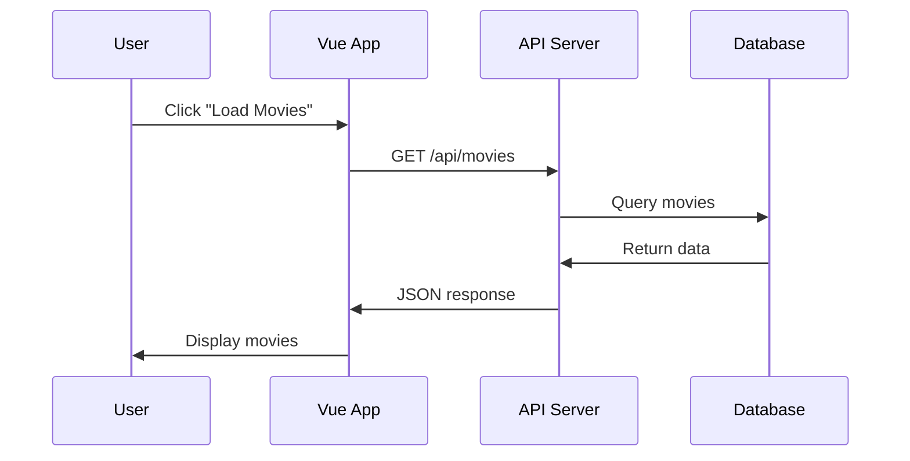

# Week 6 - Day 1: API Integration & Async Operations

## **Duration**: 1.5 hours (40 min theory + 50 min practice)

## Watch recorded lesson video here: [https://drive.google.com/file/d/13luk4smF518EFys0c4Y1lyxXQF4RYcFO/view?usp=sharing](https://drive.google.com/file/d/13luk4smF518EFys0c4Y1lyxXQF4RYcFO/view?usp=sharing)

---

## 🎯 Learning Objectives

By the end of this lesson, you will be able to:

1. **Understand** how to make HTTP requests from Vue applications
2. **Explain** the difference between Fetch API and Axios
3. **Implement** async/await for handling asynchronous operations
4. **Create** loading states and error handling mechanisms
5. **Apply** best practices for API integration in Vue
6. **Build** a data-driven application using public APIs
7. **Handle** API responses and update Vue components reactively

---

## 📚 Theory Session (40 minutes)

### What is API Integration?

API (Application Programming Interface) integration allows your Vue application to communicate with external services and databases. Instead of hardcoding data, you fetch real-time information from servers.

**Real-world analogy**: Think of an API as a waiter in a restaurant. You (the frontend) give your order to the waiter (API), who takes it to the kitchen (backend/server). The waiter then brings back your food (data).



---

### Fetch API vs Axios

#### Fetch API (Built-in Browser API)

**Pros:**
- Native to JavaScript (no installation needed)
- Modern and promise-based
- Lightweight

**Cons:**
- More verbose error handling
- Doesn't automatically transform JSON
- Limited browser support for older versions

**Example:**
```javascript
fetch('https://api.example.com/data')
  .then(response => response.json())
  .then(data => console.log(data))
  .catch(error => console.error('Error:', error));
```

#### Axios (Third-party Library)

**Pros:**
- Automatic JSON transformation
- Better error handling
- Request/response interceptors
- Timeout support
- Wider browser support

**Cons:**
- Requires installation (`npm install axios`)
- Adds ~13KB to bundle size

**Example:**
```javascript
axios.get('https://api.example.com/data')
  .then(response => console.log(response.data))
  .catch(error => console.error('Error:', error));
```

**📌 In this course, we'll use Axios for its developer-friendly features.**

---

### Installing Axios

```bash
npm install axios
```

In your Vue component:
```javascript
import axios from 'axios';
```

---

### Async/Await Syntax

Async/await makes asynchronous code look and behave more like synchronous code, making it easier to read and debug.

**Promise-based approach:**
```javascript
axios.get('https://api.example.com/data')
  .then(response => {
    console.log(response.data);
  })
  .catch(error => {
    console.error(error);
  });
```

**Async/Await approach (preferred):**
```javascript
async function fetchData() {
  try {
    const response = await axios.get('https://api.example.com/data');
    console.log(response.data);
  } catch (error) {
    console.error(error);
  }
}
```

---

### HTTP Methods Overview

| Method | Purpose | Example Use Case |
|--------|---------|------------------|
| **GET** | Retrieve data | Fetch list of users |
| **POST** | Create new data | Submit a form, create user |
| **PUT** | Update entire resource | Update user profile |
| **PATCH** | Partially update resource | Change user email only |
| **DELETE** | Remove data | Delete a post |

---

### Making API Calls in Vue Components

#### Basic Structure

```vue
<script>
import axios from 'axios';

export default {
  data() {
    return {
      movies: [],
      loading: false,
      error: null
    };
  },
  
  methods: {
    async fetchMovies() {
      this.loading = true;
      this.error = null;
      
      try {
        const response = await axios.get('https://api.example.com/movies');
        this.movies = response.data;
      } catch (error) {
        this.error = 'Failed to load movies. Please try again.';
        console.error('API Error:', error);
      } finally {
        this.loading = false;
      }
    }
  },
  
  mounted() {
    this.fetchMovies();
  }
};
</script>
```

---

### Handling Loading States

Users should always know when data is being fetched. Display loading indicators to improve UX.

```vue
<template>
  <div>
    <!-- Loading State -->
    <div v-if="loading" class="text-center py-8">
      <div class="animate-spin rounded-full h-12 w-12 border-b-2 border-blue-500 mx-auto"></div>
      <p class="mt-4 text-gray-600">Loading movies...</p>
    </div>
    
    <!-- Error State -->
    <div v-else-if="error" class="bg-red-100 border border-red-400 text-red-700 px-4 py-3 rounded">
      {{ error }}
    </div>
    
    <!-- Success State -->
    <div v-else>
      <div v-for="movie in movies" :key="movie.id" class="movie-card">
        {{ movie.title }}
      </div>
    </div>
  </div>
</template>
```

---

### Error Handling Best Practices

**1. User-Friendly Messages:**
```javascript
catch (error) {
  if (error.response) {
    // Server responded with error status
    this.error = `Error ${error.response.status}: ${error.response.data.message}`;
  } else if (error.request) {
    // Request made but no response
    this.error = 'No response from server. Check your internet connection.';
  } else {
    // Something else happened
    this.error = 'An unexpected error occurred.';
  }
}
```

**2. Retry Mechanism:**
```javascript
methods: {
  async fetchDataWithRetry(retries = 3) {
    for (let i = 0; i < retries; i++) {
      try {
        const response = await axios.get('https://api.example.com/data');
        return response.data;
      } catch (error) {
        if (i === retries - 1) throw error;
        await new Promise(resolve => setTimeout(resolve, 1000)); // Wait 1s before retry
      }
    }
  }
}
```

---

### Working with Query Parameters

```javascript
// Option 1: String concatenation
axios.get(`https://api.example.com/movies?category=${category}&year=${year}`)

// Option 2: Params object (preferred)
axios.get('https://api.example.com/movies', {
  params: {
    category: 'action',
    year: 2024,
    limit: 10
  }
})
```

---

### Popular Free APIs for Practice

| API | Description | URL |
|-----|-------------|-----|
| **JSONPlaceholder** | Fake REST API for testing | https://jsonplaceholder.typicode.com |
| **OMDb API** | Movie database | https://www.omdbapi.com |
| **OpenWeather** | Weather data | https://openweathermap.org/api |
| **The Cat API** | Random cat images | https://thecatapi.com |
| **REST Countries** | Country information | https://restcountries.com |
| **CoinGecko** | Cryptocurrency data | https://www.coingecko.com/api |

---

## 💻 Hands-On Practice (50 minutes)

### Exercise 1: Fetch Posts from JSONPlaceholder

**Objective**: Create a simple blog post viewer using JSONPlaceholder API.

**Instructions**:

1. Create a new Vue component `PostList.vue`
2. Install Axios: `npm install axios`
3. Fetch posts from `https://jsonplaceholder.typicode.com/posts`
4. Display loading state while fetching
5. Show error message if request fails
6. Display posts in a clean card layout with Tailwind CSS

**Expected Output**: A list of blog posts with titles and bodies, with proper loading and error states.

**Solution**:

```vue
<template>
  <div class="container mx-auto px-4 py-8">
    <h1 class="text-3xl font-bold mb-6 text-gray-800">Blog Posts</h1>
    
    <!-- Loading State -->
    <div v-if="loading" class="flex flex-col items-center justify-center py-12">
      <div class="animate-spin rounded-full h-16 w-16 border-b-4 border-blue-500"></div>
      <p class="mt-4 text-gray-600 text-lg">Loading posts...</p>
    </div>
    
    <!-- Error State -->
    <div v-else-if="error" class="bg-red-100 border-l-4 border-red-500 text-red-700 p-4 rounded" role="alert">
      <p class="font-bold">Error</p>
      <p>{{ error }}</p>
      <button @click="fetchPosts" class="mt-2 bg-red-500 text-white px-4 py-2 rounded hover:bg-red-600">
        Retry
      </button>
    </div>
    
    <!-- Success State -->
    <div v-else class="grid grid-cols-1 md:grid-cols-2 lg:grid-cols-3 gap-6">
      <div 
        v-for="post in posts" 
        :key="post.id"
        class="bg-white rounded-lg shadow-md hover:shadow-xl transition-shadow duration-300 p-6"
      >
        <h2 class="text-xl font-semibold text-gray-800 mb-2">
          {{ post.title }}
        </h2>
        <p class="text-gray-600 text-sm">
          {{ post.body }}
        </p>
        <div class="mt-4 flex justify-between items-center">
          <span class="text-xs text-gray-500">Post #{{ post.id }}</span>
          <span class="text-xs text-gray-500">User {{ post.userId }}</span>
        </div>
      </div>
    </div>
  </div>
</template>

<script>
import axios from 'axios';

export default {
  name: 'PostList',
  
  data() {
    return {
      posts: [],
      loading: false,
      error: null
    };
  },
  
  methods: {
    async fetchPosts() {
      this.loading = true;
      this.error = null;
      
      try {
        const response = await axios.get('https://jsonplaceholder.typicode.com/posts');
        this.posts = response.data.slice(0, 12); // Limit to 12 posts
      } catch (error) {
        this.error = 'Failed to load posts. Please check your connection and try again.';
        console.error('API Error:', error);
      } finally {
        this.loading = false;
      }
    }
  },
  
  mounted() {
    this.fetchPosts();
  }
};
</script>
```

---

### Exercise 2: Search Functionality with API

**Objective**: Build a movie search app using OMDb API.

**Instructions**:

1. Sign up for a free API key at https://www.omdbapi.com/apikey.aspx
2. Create `MovieSearch.vue` component
3. Add a search input field
4. Fetch movies when user types (with debouncing)
5. Display movie cards with poster, title, and year
6. Handle "Movie not found" errors

**Expected Output**: A search interface that shows movie results as you type.

**Solution**:

```vue
<template>
  <div class="container mx-auto px-4 py-8">
    <h1 class="text-4xl font-bold text-center mb-8 text-gray-800">Movie Search</h1>
    
    <!-- Search Input -->
    <div class="max-w-2xl mx-auto mb-8">
      <input
        v-model="searchQuery"
        @input="handleSearch"
        type="text"
        placeholder="Search for movies..."
        class="w-full px-6 py-4 text-lg border-2 border-gray-300 rounded-lg focus:outline-none focus:border-blue-500"
      />
    </div>
    
    <!-- Loading State -->
    <div v-if="loading" class="text-center py-12">
      <div class="animate-spin rounded-full h-16 w-16 border-b-4 border-blue-500 mx-auto"></div>
      <p class="mt-4 text-gray-600">Searching movies...</p>
    </div>
    
    <!-- Error State -->
    <div v-else-if="error" class="text-center py-12">
      <p class="text-red-500 text-lg">{{ error }}</p>
    </div>
    
    <!-- No Results -->
    <div v-else-if="searchQuery && movies.length === 0 && !loading" class="text-center py-12">
      <p class="text-gray-500 text-lg">No movies found. Try another search term.</p>
    </div>
    
    <!-- Movies Grid -->
    <div v-else-if="movies.length > 0" class="grid grid-cols-2 md:grid-cols-3 lg:grid-cols-4 gap-6">
      <div 
        v-for="movie in movies" 
        :key="movie.imdbID"
        class="bg-white rounded-lg shadow-lg overflow-hidden hover:scale-105 transition-transform duration-300"
      >
        
        <div class="p-4">
          <h3 class="font-semibold text-gray-800 truncate">{{ movie.Title }}</h3>
          <p class="text-sm text-gray-600">{{ movie.Year }}</p>
        </div>
      </div>
    </div>
    
    <!-- Initial State -->
    <div v-else class="text-center py-12">
      <p class="text-gray-500 text-lg">Start typing to search for movies...</p>
    </div>
  </div>
</template>

<script>
import axios from 'axios';

export default {
  name: 'MovieSearch',
  
  data() {
    return {
      searchQuery: '',
      movies: [],
      loading: false,
      error: null,
      debounceTimer: null
    };
  },
  
  methods: {
    handleSearch() {
      // Clear previous timer
      clearTimeout(this.debounceTimer);
      
      // Don't search if query is empty
      if (!this.searchQuery.trim()) {
        this.movies = [];
        return;
      }
      
      // Wait 500ms after user stops typing
      this.debounceTimer = setTimeout(() => {
        this.searchMovies();
      }, 500);
    },
    
    async searchMovies() {
      this.loading = true;
      this.error = null;
      
      try {
        const API_KEY = 'YOUR_API_KEY'; // Replace with your actual API key
        const response = await axios.get('https://www.omdbapi.com/', {
          params: {
            apikey: API_KEY,
            s: this.searchQuery,
            type: 'movie'
          }
        });
        
        if (response.data.Response === 'True') {
          this.movies = response.data.Search;
        } else {
          this.movies = [];
          this.error = response.data.Error;
        }
      } catch (error) {
        this.error = 'Failed to search movies. Please try again.';
        console.error('API Error:', error);
      } finally {
        this.loading = false;
      }
    }
  }
};
</script>
```

---

### Exercise 3: POST Request - Create New Resource

**Objective**: Create a form to add new posts to JSONPlaceholder API.

**Instructions**:

1. Create a form with title and body inputs
2. Send POST request to create new post
3. Show success message after creation
4. Clear form after successful submission

**Expected Output**: A working form that creates new posts and provides feedback.

**Solution**:

```vue
<template>
  <div class="container mx-auto px-4 py-8 max-w-2xl">
    <h1 class="text-3xl font-bold mb-6">Create New Post</h1>
    
    <!-- Success Message -->
    <div v-if="successMessage" class="bg-green-100 border-l-4 border-green-500 text-green-700 p-4 mb-6 rounded">
      {{ successMessage }}
    </div>
    
    <!-- Error Message -->
    <div v-if="error" class="bg-red-100 border-l-4 border-red-500 text-red-700 p-4 mb-6 rounded">
      {{ error }}
    </div>
    
    <!-- Form -->
    <form @submit.prevent="createPost" class="bg-white shadow-md rounded-lg p-6">
      <div class="mb-4">
        <label for="title" class="block text-gray-700 font-semibold mb-2">Title</label>
        <input
          id="title"
          v-model="form.title"
          type="text"
          required
          class="w-full px-4 py-2 border border-gray-300 rounded-lg focus:outline-none focus:border-blue-500"
          placeholder="Enter post title"
        />
      </div>
      
      <div class="mb-6">
        <label for="body" class="block text-gray-700 font-semibold mb-2">Content</label>
        <textarea
          id="body"
          v-model="form.body"
          required
          rows="6"
          class="w-full px-4 py-2 border border-gray-300 rounded-lg focus:outline-none focus:border-blue-500"
          placeholder="Write your post content..."
        ></textarea>
      </div>
      
      <button
        type="submit"
        :disabled="loading"
        class="w-full bg-blue-500 text-white font-semibold py-3 px-6 rounded-lg hover:bg-blue-600 disabled:bg-gray-400 disabled:cursor-not-allowed transition-colors"
      >
        {{ loading ? 'Creating...' : 'Create Post' }}
      </button>
    </form>
  </div>
</template>

<script>
import axios from 'axios';

export default {
  name: 'CreatePost',
  
  data() {
    return {
      form: {
        title: '',
        body: ''
      },
      loading: false,
      successMessage: '',
      error: null
    };
  },
  
  methods: {
    async createPost() {
      this.loading = true;
      this.error = null;
      this.successMessage = '';
      
      try {
        const response = await axios.post('https://jsonplaceholder.typicode.com/posts', {
          title: this.form.title,
          body: this.form.body,
          userId: 1
        });
        
        console.log('Created post:', response.data);
        this.successMessage = `Post created successfully! ID: ${response.data.id}`;
        
        // Clear form
        this.form.title = '';
        this.form.body = '';
        
        // Hide success message after 5 seconds
        setTimeout(() => {
          this.successMessage = '';
        }, 5000);
        
      } catch (error) {
        this.error = 'Failed to create post. Please try again.';
        console.error('API Error:', error);
      } finally {
        this.loading = false;
      }
    }
  }
};
</script>
```

---
📝 **[Homework Assignment](../homeworks/w6d1-homework.md)**
---
## 📝 Summary

Today we covered:

- **API Integration fundamentals** and why they're essential for modern web apps
- **Fetch API vs Axios** - understanding when to use each
- **Async/await syntax** for cleaner asynchronous code
- **HTTP methods** (GET, POST, PUT, DELETE) and their purposes
- **Loading states** to improve user experience
- **Error handling** best practices for robust applications
- **Query parameters** for filtering and searching data
- **Practical examples** with JSONPlaceholder and OMDb APIs
- **Real-world applications** including search functionality and form submissions

**Key Takeaways:**
- Always handle loading and error states
- Use async/await for readable asynchronous code
- Implement debouncing for search functionality
- Provide user feedback for all API operations
- Keep API keys secure (use environment variables in production)

---

## 📚 Additional Resources

- [Axios Documentation](https://axios-http.com/docs/intro)
- [MDN: Using Fetch](https://developer.mozilla.org/en-US/docs/Web/API/Fetch_API/Using_Fetch)
- [Vue.js: Data Fetching](https://vuejs.org/guide/extras/reactivity-in-depth.html)
- [JSONPlaceholder API Guide](https://jsonplaceholder.typicode.com/guide/)
- [Public APIs List](https://github.com/public-apis/public-apis)
- [HTTP Status Codes Reference](https://developer.mozilla.org/en-US/docs/Web/HTTP/Status)
